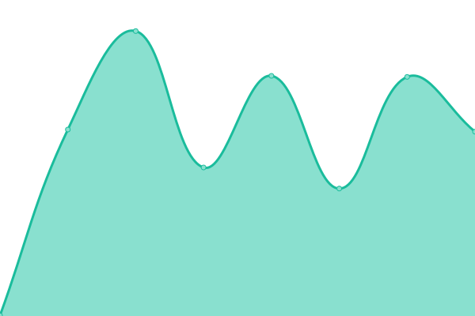
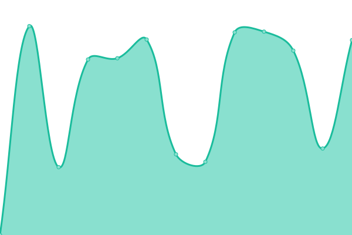
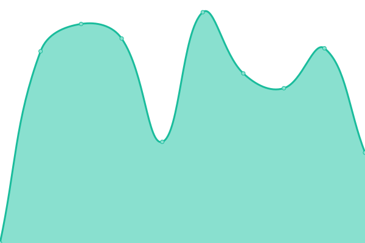

# [📈 Live Status](https://keywordnew.github.io/jinju-watchtower): <!--live status--> **🟧 Partial outage**

This repository contains the open-source uptime monitor and status page for [Manil Chowdhury](https://manil.xyz), powered by [Upptime](https://github.com/upptime/upptime).

With [Upptime](https://upptime.js.org), you can get your own unlimited and free uptime monitor and status page, powered entirely by a GitHub repository. We use [Issues](https://github.com/keywordnew/jinju-watchtower/issues) as incident reports, [Actions](https://github.com/keywordnew/jinju-watchtower/actions) as uptime monitors, and [Pages](https://keywordnew.github.io/jinju-watchtower) for the status page.

<!--start: status pages-->
<!-- This summary is generated by Upptime (https://github.com/upptime/upptime) -->
<!-- Do not edit this manually, your changes will be overwritten -->
<!-- prettier-ignore -->
| URL | Status | History | Response Time | Uptime |
| --- | ------ | ------- | ------------- | ------ |
|  [한국 수자원 공사 (Korea Water Resources Corporation)](https://www.kwater.or.kr/main.do?s_mid=1) | 🟩 Up | [korea-water-resources-corporation.yml](https://github.com/neighbourhood-cyber/jinju-watchtower/commits/HEAD/history/korea-water-resources-corporation.yml) | 

 1841ms
     
 | 

<a href="https://keywordnew.github.io/jinju-watchtower/history/korea-water-resources-corporation">100.00%</a>
    

|  [한국 전력 공사 (Korea Electric Power Corporation)](https://home.kepco.co.kr/kepco/main.do) | 🟩 Up | [korea-electric-power-corporation.yml](https://github.com/neighbourhood-cyber/jinju-watchtower/commits/HEAD/history/korea-electric-power-corporation.yml) | 

 1916ms
     
 | 

<a href="https://keywordnew.github.io/jinju-watchtower/history/korea-electric-power-corporation">100.00%</a>
    

|  [에스케이텔레콤 (SK Telecom Co., Ltd.)](https://www.sktelecom.com/) | 🟩 Up | [sk-telecom-co-ltd.yml](https://github.com/neighbourhood-cyber/jinju-watchtower/commits/HEAD/history/sk-telecom-co-ltd.yml) | 

 494ms
     
 | 

<a href="https://keywordnew.github.io/jinju-watchtower/history/sk-telecom-co-ltd">100.00%</a>
    

|  [Gyeongsang National University Hospital](https://www.gnuh.co.kr/) | 🟥 Down | [gyeongsang-national-university-hospital.yml](https://github.com/neighbourhood-cyber/jinju-watchtower/commits/HEAD/history/gyeongsang-national-university-hospital.yml) | 

 0ms
     
 | 

<a href="https://keywordnew.github.io/jinju-watchtower/history/gyeongsang-national-university-hospital">0.00%</a>
    

|  [진주경찰서 (Jinju Police Station)](http://www.gnpolice.go.kr/jj/) | 🟩 Up | [jinju-police-station.yml](https://github.com/neighbourhood-cyber/jinju-watchtower/commits/HEAD/history/jinju-police-station.yml) | 

 975ms
     
 | 

<a href="https://keywordnew.github.io/jinju-watchtower/history/jinju-police-station">59.29%</a>
    

|  [부산교통공사 (Busan Transportation Corporation, Jinju)](http://www2.humetro.busan.kr/default/main.do) | 🟩 Up | [busan-transportation-corporation-jinju.yml](https://github.com/neighbourhood-cyber/jinju-watchtower/commits/HEAD/history/busan-transportation-corporation-jinju.yml) | 

 6182ms
     
 | 

<a href="https://keywordnew.github.io/jinju-watchtower/history/busan-transportation-corporation-jinju">93.74%</a>
    

|  [주식회사 국민은행 (KB Bank)](https://www.kbstar.com/) | 🟩 Up | [kb-bank.yml](https://github.com/neighbourhood-cyber/jinju-watchtower/commits/HEAD/history/kb-bank.yml) | 

 3114ms
     
 | 

<a href="https://keywordnew.github.io/jinju-watchtower/history/kb-bank">96.09%</a>
    

<!--end: status pages-->

[**Visit our status website →**](https://keywordnew.github.io/jinju-watchtower)

## 📄 License

- Powered by: [Upptime](https://github.com/upptime/upptime)
- Code: [MIT](./LICENSE) © [Manil Chowdhury](https://manil.xyz)
- Data in the `./history` directory: [Open Database License](https://opendatacommons.org/licenses/odbl/1-0/)
